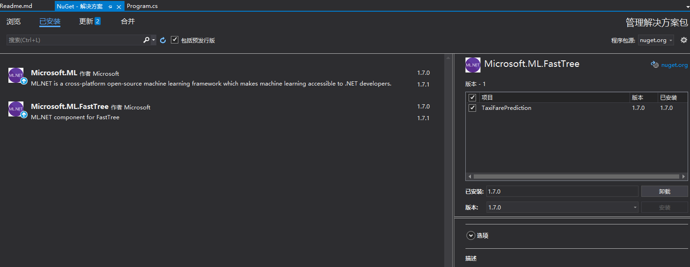


https://docs.microsoft.com/zh-cn/dotnet/machine-learning/tutorials/predict-prices

# 操作步骤

vs2019+net5，创建一个c#的控制台项目。 这个项目根据历史出租车的费用记录，来估算一个乘客的未完成单的预计费用。这是一个很简单的场景，因为计费本身就是利用一个计费公式的。 所以利用回归来预测。

* 这次通过nugut引入ml库和引入Microsoft.ML.FastTree



* 工程中创建一个Data目录，并将下载之后的mdf文件拷贝到该Data目录下。

* 在"解决方案资源管理器"中，右键单击每个 *.csv文件，然后选择"属性 "。 在“高级”下，将“复制到输出目录”的值更改为“如果较新则复制”。

* 分析标签label和特征features。 label就是我们需要预测的字段，而feature则是用于输入的字段。

<table>
    <tr>
        <td>vendor_id</td><td>出租车供应商的 ID 是一项特征。</td>  </tr>
        <tr>
         <td>rate_code</td><td>出租车行程的费率类型是一项特征。</td>
         </tr>
         <tr>
         <td>passenger_count</td><td>行程中的乘客人数是一项特征。</td>
         </tr>
         <tr>
         <td>trip_time_in_secs</td><td>这次行程所花的时间。 希望在行程完成前预测行程费用。 当时并不知道行程有多长时间。 因此，行程时间不是一项特征，需要从模型删除此列。</td>
        </tr><tr>
        <td>trip_distance</td><td>行程距离是一项特征。</td>
        </tr>
        <tr>
        <td>payment_type</td><td>付款方式（现金或信用卡）是一项特征。</td>
        </tr><tr>
        <td>fare_amount</td><td>支付的总出租车费用是一个标签。</td>
        </tr>
</table>


* using命令空间

```
using System;
using Microsoft.ML;
using Microsoft.ML.Data;
using Microsoft.ML.Transforms.TimeSeries;
using System.Data.SqlClient;
using System.IO;
```

剩下的内容就都在Program.cs代码中了。
