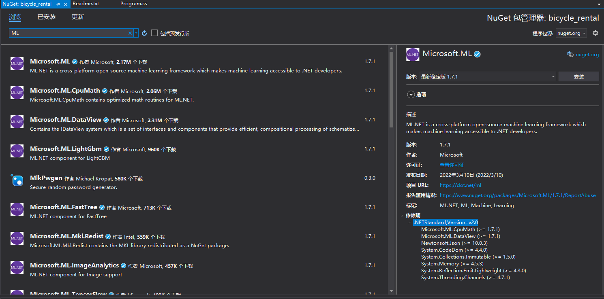
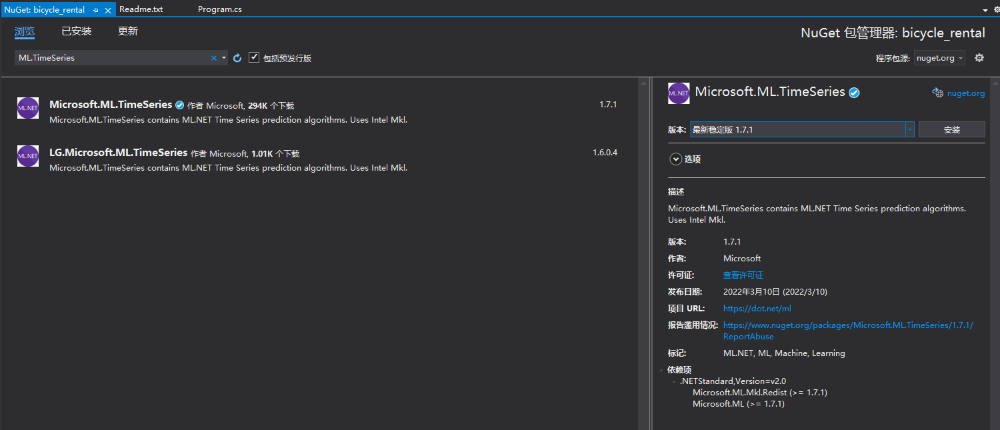
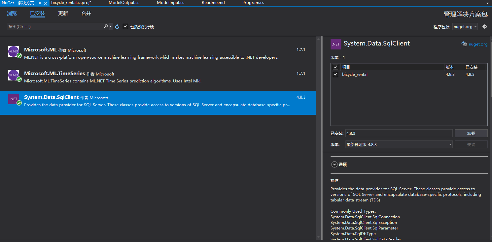


https://docs.microsoft.com/zh-cn/dotnet/machine-learning/tutorials/time-series-demand-forecasting

# 操作步骤

vs2019+net5，创建一个c#的控制台项目。

* 这次通过nugut引入ml库



* 引入Microsoft.ML.TimeSeries库。 引入System.Data.SqlClient。






* 下载训练用的[数据](https://github.com/dotnet/machinelearning-samples/raw/main/samples/csharp/getting-started/Forecasting_BikeSharingDemand/BikeDemandForecasting/Data/DailyDemand.mdf)

数据集相关的作者的springer上的相关[文章](https://link.springer.com/article/10.1007/s13748-013-0040-3)

完整数据集可以在[uci](http://archive.ics.uci.edu/ml/datasets/bike+sharing+dataset)上看到具体描述。


* 工程中创建一个Data目录，并将下载之后的mdf文件拷贝到该Data目录下。


* using命令空间

```
using System;
using Microsoft.ML;
using Microsoft.ML.Data;
using Microsoft.ML.Transforms.TimeSeries;
using System.Data.SqlClient;
using System.IO;
```

剩下的内容就都在Program.cs代码中了。
